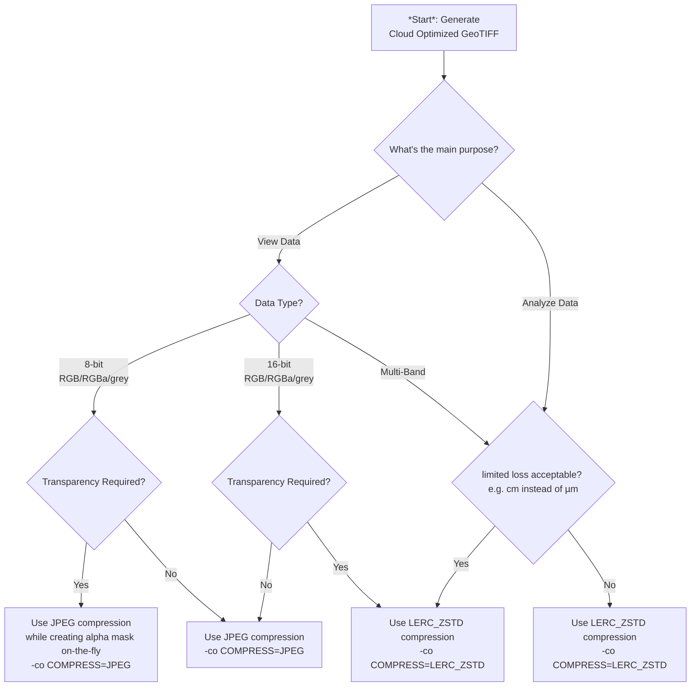

# Best Practices for Cloud-Optimized GeoTIFFs (COGs) for the use in Swiss Geospatial Infastructures 

Our goal is to establish and share optimal command line snippets for creating  [Cloud-Optimized GeoTIFFs (COGs)](https://cogeo.org/) within the Swiss geospatial context (aka EPSG 2056 users) via a decision tree for  various use cases.
COGs are standard GeoTIFF files optimized for cloud environments, allowing for efficient access to specific parts of large datasets without downloading entire files.

*Pull Requests Accepted:* This Best Practice Guide is fully community driven. If something is not right, or if you want to contribute a use case, add your tutorial to the implementation list or tell ~~Switzerland~~ the world about the awesome gdal / r snippets you are making available then please [contribute](#contributing).

# Choose your case


# Workflows
## Virtual Raster Tiles (VRT)
When dealing with a large number of input files, it's often more efficient to use a VRT (Virtual Raster) approach. This method allows you to create a virtual dataset that combines multiple raster files without actually merging the data. Here's how you can do this:

1. First, set up the options for gdalbuildvrt and gdal_translate:

```bash
gdalbuildvrt_options=(
  --config NUM_THREADS ALL_CPUS
  --config GDAL_DISABLE_READDIR_ON_OPEN EMPTY_DIR
  # Add any other gdalbuildvrt options here
)

gdal_translate_options=(
  --config NUM_THREADS ALL_CPUS
  --config GDAL_DISABLE_READDIR_ON_OPEN EMPTY_DIR

  # Add any other gdal_translate options from the decision tree here
)
```
2. Create the VRT file and then translate it to a COG:

```bash
echo "Creating VRT and translating to COG..."
gdalbuildvrt "${gdalbuildvrt_options[@]}" -input_file_list "${input_file_list}" "${temp_vrt}"
gdal_translate "${gdal_translate_options[@]}" "${temp_vrt}" "${output_file}"
```
It's important to set the `--config GDAL_DISABLE_READDIR_ON_OPEN EMPTY_DIR` option when creating the VRT file. This prevents GDAL from attempting to search for additional files (like world files) for each of the input images, which can significantly speed up the process when dealing with a large number of files.

This approach is particularly useful when you're working with thousands of input files, as it allows GDAL to efficiently handle the data without trying to load everything into memory at once

## Batch conversion

### Windows: cmd.exe

```cmd
FOR %f IN ("C:\path\to\folder\*.tif") DO (
  gdal_translate -of COG  [... params ...]  %f C:\path\to\output\%~nf.tif
)
```

### Linux: bash

```bash
for f in /path/to/folder/*.tif
  do gdal_translate -of COG  [... params ...]  $f /path/to/output/$(basename -s .tif $f).tif
done
```
# Raster
Apply the optimization steps according to the use case and create Cloud Optimized GeoTIFF [COG](https://cogeo.org) using a recent version of [gdal](https://gdal.org). Windows users may use the OSGeo4WShell provided by [QGIS](https://qgis.org).

## lossless raster

Apply optimization steps for raster data
1. prepare input data at a reasonable precision (i.e. `cm` instead of `µm` or `nm` i.e. in the data source)
2. compress your data using
    ```
    gdal_translate -a_srs EPSG:2056 -of COG -co COMPRESS=LERC_ZSTD -co LEVEL=22 -co NUM_THREADS=ALL_CPUS -co BIGTIFF=YES -co STATISTICS=YES -tr <resolution in meter> <resolution in meter> -r Cubic -a_nodata <value> -ot <datatype> <input.tif> <output.tif>
    ```
    while
    - choosing the appropriate scale and offset for the data if feasible (i.e. scale `cm` instead of `m` using [-a_scale](https://gdal.org/en/stable/programs/gdal_translate.html#cmdoption-gdal_translate-a_scale)) and / or offset (using [-a_offset](https://gdal.org/en/stable/programs/gdal_translate.html#cmdoption-gdal_translate-a_offset)) to better fit the numbers
      - rescaling the data on the fly if not preprocessed already using [-scale](https://gdal.org/en/stable/programs/gdal_translate.html#cmdoption-gdal_translate-scale)
    - choosing to the most appropriate data type ([Byte/Int8/Int16/UInt16/UInt32/Int32/Float32](https://gdal.org/en/stable/programs/gdal_translate.html#cmdoption-gdal_translate-ot)) using the least amount of bits possible.

#### _Notes on `LERC_ZSTD` (lossy/lossless) compression_
- _`MAX_Z_ERROR` defaults to `0` (lossless)_
- _supported since [GDAL](https://gdal.org) v2.4+_ thus also in QGIS, etc.
- _supported by [geotiff.js](https://geotiffjs.github.io/) v2.1+_ thus also in openlayers, etc.
- _has been [developed and published by ESRI](https://github.com/esri/lerc/) and is supported in their products_
- _supported in STAC-browser v3.4_

## lossy numerical raster

1. compress your data using
    ```
    gdal_translate -a_srs EPSG:2056 -of COG -co COMPRESS=LERC_ZSTD -co LEVEL=22 -co NUM_THREADS=ALL_CPUS -co BIGTIFF=YES -co STATISTICS=YES -co MAX_Z_ERROR=<threshold> -tr <resolution in meter> <resolution in meter> -r Cubic -a_nodata <value> -ot <datatype> <input.tif> <output.tif>
    ```
    while
    - choosing a [threshold](https://gdal.org/en/stable/drivers/raster/cog.html#general-creation-options:~:text=MAX_Z_ERROR) (limited error tolerance i.e. `0.01` for `cm`) for better lossy compression ratio

## lossy visual image

1. compress your data using
    ```
    gdal_translate -a_srs EPSG:2056 -of COG -co COMPRESS=JPEG -co NUM_THREADS=ALL_CPUS -co BIGTIFF=YES -co STATISTICS=YES -co QUALITY=70  -tr <resolution in meter> <resolution in meter> -r Cubic <input.tif> <output.tif>
    ```

## lossy visual image with transparency

1. compress your data using
    ```
    gdalwarp -s_srs EPSG:2056 -of COG -co COMPRESS=JPEG -co NUM_THREADS=ALL_CPUS -co BIGTIFF=YES -co STATISTICS=YES -co QUALITY=70 -tr <resolution in meter> <resolution in meter> -r Cubic -multi -wo NUM_THREADS=ALL_CPUS -dstalpha -srcnodata <value> <input.tif> <output.tif>
    ```
    while
    - using [`-dstalpha`](https://gdal.org/en/stable/programs/gdalwarp.html#cmdoption-gdalwarp-dstalpha)
    - setting [`-srcnodata`](https://gdal.org/en/stable/programs/gdalwarp.html#cmdoption-gdalwarp-srcnodata) to the nodata value per band as eg `"0 0 0"` see [explanation below](#notes-on-alpha-channel)
    - or if the source data already has an alpha band:
      - setting [`-srcalpha`](https://gdal.org/en/stable/programs/gdalwarp.html#cmdoption-gdalwarp-srcalpha)

    result:
    - grey+alpha or RGB+alpha image representing the data

#### _Notes on alpha channel_
- transparency is stored in the extra alpha channel
- it can be created on the fly from _nodata_ at the source (i.e. [`-srcnodata "0 0 0"`](https://gdal.org/en/stable/programs/gdalwarp.html#cmdoption-gdalwarp-srcnodata) for black in RGB source image)
- unused input bands (NIR, etc.) may be dropped (i.e. [`-nosrcalpha`](https://gdal.org/en/stable/programs/gdalwarp.html#cmdoption-gdalwarp-nosrcalpha) [`-srcband 2 -srcband 3 -srcband 4`](https://gdal.org/en/stable/programs/gdalwarp.html#cmdoption-gdalwarp-srcband) to generate RGB from NRGB)
- it can also be created by clipping using a [`cutline`](https://gdal.org/en/stable/programs/gdalwarp.html#cmdoption-gdalwarp-cutline) (i.e. polygon from a file)
- even clip offsetting is possible (see [`-cblend`](https://gdal.org/en/stable/programs/gdalwarp.html#cmdoption-gdalwarp-cblend))

## Contributing

We strongly encourage and welcome contributions from all members / enthusiasts of the cloud native geospatial community! Your expertise and experiences are invaluable in refining these best practices and ensuring they meet the unique needs of our diverse geographical and technological landscape.

Here's how you can contribute:

1. **Share Your Experience**: If you've implemented COGs in your projects, we'd love to hear about your approach and lessons learned.
2. **Suggest Improvements**: Found a way to optimize COG creation or usage? Submit a pull request with your suggestions.
3. **Report Issues**: If you encounter problems or have questions, please open an issue. It helps everyone learn and improve.
4. **Review and Discuss**: Participate in discussions on open pull requests and issues. Your perspective matters!

To contribute:
1. Fork this repository
2. Create a new branch for your changes
3. Make your changes and commit them to the 'dev' branch
4. Submit a pull request with a clear description of your modifications

Remember, no contribution is too small. Whether it's fixing a typo, adding a use case, or proposing a new best practice, every input helps build a stronger, more knowledgeable Swiss geospatial community.

Let's work together to optimize our geospatial workflows and make Swiss geographic data more accessible and efficient for everyone!

## References

For further information and more in-depth explanations of Cloud Optimized GeoTIFFs in context with gdal and related topics, please see the following resources:

*   GDAL COG Driver: [https://gdal.org/drivers/raster/cog.html](https://gdal.org/drivers/raster/cog.html)
*   gdal_translate: [https://gdal.org/en/stable/programs/gdal_translate.html](https://gdal.org/en/stable/programs/gdal_translate.html)
*   GDAL Cloud Optimized GeoTIFF Wiki: [https://trac.osgeo.org/gdal/wiki/CloudOptimizedGeoTIFF](https://trac.osgeo.org/gdal/wiki/CloudOptimizedGeoTIFF)
*   GeoTIFF Compression Optimization Guide: [https://kokoalberti.com/articles/geotiff-compression-optimization-guide](https://kokoalberti.com/articles/geotiff-compression-optimization-guide)
*   COG Recipes: [https://github.com/Doctor-Who/cog-recipes?tab=readme-ov-file](https://github.com/Doctor-Who/cog-recipes?tab=readme-ov-file)
*   Image Compression: [https://wiesehahn.github.io/posts/image_compression/](https://wiesehahn.github.io/posts/image_compression/)
